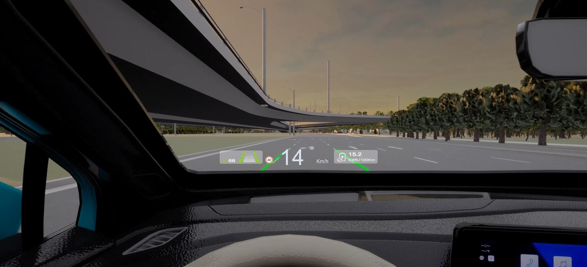
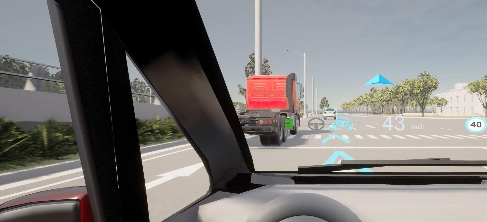
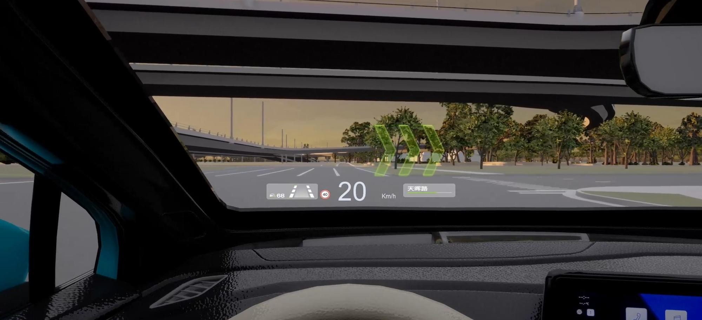
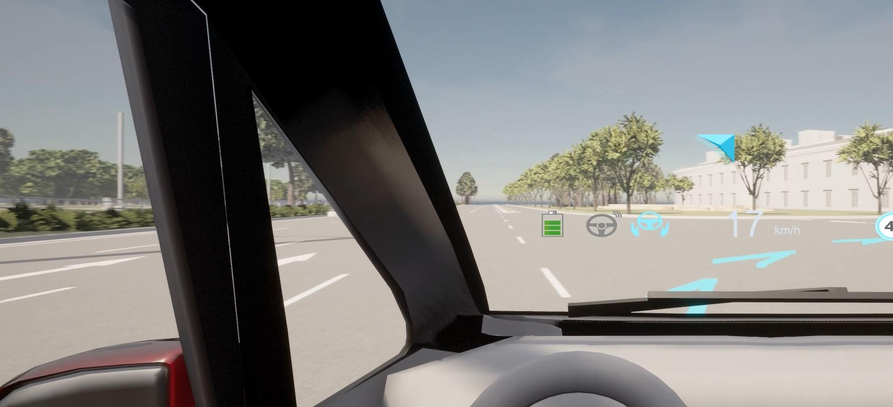

# 
LIBRA：One-stop platform for intelligent design and verification of vehicle HUD

# About the Team
LIBRA has a diverse team composed of members from universities, car companies and industry associations, and is committed to building a new global smart car human-computer interaction ecosystem. LIBRA is user-oriented and focused on improving the quality of human-computer interaction technology. By creating a credible and reliable open source R&D and testing platform and establishing a standardized data sharing and collaboration mechanism, LIBRA provides developers, researchers and industry practitioners with flexible and easy-to-use standardized R&D tools and testing environments, lowering the threshold for technology R&D, breaking down information barriers in different industries such as automobiles, transportation, machinery, and industrial engineering, and promoting cross-industry collaboration. By building an inclusive and open community, LIBRA attracts global practitioners to jointly promote breakthrough innovations and implementation of smart, safe and friendly smart car human-computer interaction technologies.
# Software Introduction
With the rapid development of vehicle intelligence, HUD is becoming an important means to improve driving safety and user experience. However, the research and development of existing HUDs faces problems such as disconnection between interface design, algorithm development and test verification, high experimental verification costs, and low iteration efficiency of HUD solutions, which affect the actual use effect and human performance of HUD. In addition, traditional experimental methods are difficult to obtain sufficient human factors data when simulating real driving scenarios, which further limits the improvement of HUD effects. Based on this, the project team jointly developed Libra, a one-stop intelligent open source software for human-friendly in-vehicle HUD design and verification, by combining resources from universities, car companies, industry associations, etc. It integrates HUD interface design modules, algorithm development modules, and real-life in-loop test verification modules, realizing an efficient closed loop from interface design to test verification.

LIBRA supports designers to customize and automatically check the compliance of the HUD interface, supports designers to view the effect of the interface design in a highly realistic dynamic traffic environment, and supports one-click export of configuration files to simulation and test verification modules; at the same time, LIBRA provides a flexible HUD algorithm configuration environment, supports algorithm developers to flexibly bind the HUD interface with the HUD algorithm, advanced driver assistance algorithm, and autonomous driving algorithm to achieve dynamic adjustment and fusion testing of functional logic; LIBRA has built-in more than ten types of functional logic such as driving status display, navigation assistance, and autonomous driving takeover; in addition, LIBRA has built a virtual simulation and real-life driving simulation experimental environment, which can simulate a variety of HUD usage scenarios and comprehensively evaluate the effect of HUD through data analysis. Based on extensive evaluation data, the LIBRA community provides comprehensive HUD evaluation services and in-depth peer comparisons.
# LIBRA Official Website
[LIBRA Official Website](https://libra.dinglantech.com)

# Software Usage Conditions

## 1. CARLA Install

- **Install Dependencies**

- **Install Unreal Engine**

- **CARLA Compile**

## 2. SUMO-CARLA Joint Configuration

- **SUMO Install**

- **SUMO-CARLA Joint Configuration**
  
**For detailed installation steps, see the link**：[Installation Reference Guide](libra.dinglantech.com/home)

# Use Cases

Mainstream Benchmark Easily reproduce the HUD design solutions of mainstream car companies, and deeply analyze industry standards and technical details |  Unlimited Creativity  Independent innovative design, free combination, exploring new possibilities of HUD
:---------:|:---------------------------:
| 
 | 

# Map Install
https://pan.baidu.com/s/1R6PrkN8dxhtlb_0ap_TB_A?pwd=b7av

